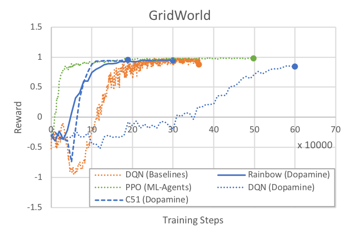
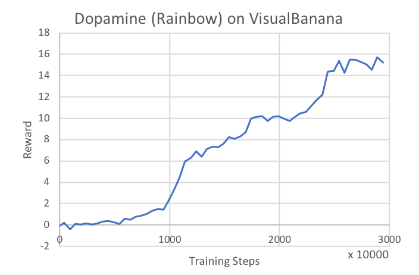

# Unity ML-Agents Gym Wrapper

A common way in which machine learning researchers interact with simulation
environments is via a wrapper provided by OpenAI called `gym`. For more
information on the gym interface, see [here](https://github.com/openai/gym).

We provide a gym wrapper and instructions for using it with existing machine
learning algorithms which utilize gym. Our wrapper provides interfaces on top of
our `UnityEnvironment` class, which is the default way of interfacing with a
Unity environment via Python.

## Installation

The gym wrapper can be installed using:

```sh
pip3 install gym_unity
```

or by running the following from the `/gym-unity` directory of the repository:

```sh
pip3 install -e .
```

## Using the Gym Wrapper

The gym interface is available from `gym_unity.envs`. To launch an environment
from the root of the project repository use:

```python
from gym_unity.envs import UnityToGymWrapper

env = UnityToGymWrapper(unity_environment, worker_id, use_visual, uint8_visual)
```

- `unity_environment` refers to the Unity environment to be wrapped.

- `use_visual` refers to whether to use visual observations (True) or vector
  observations (False) as the default observation provided by the `reset` and
  `step` functions. Defaults to `False`.

- `uint8_visual` refers to whether to output visual observations as `uint8`
  values (0-255). Many common Gym environments (e.g. Atari) do this. By default
  they will be floats (0.0-1.0). Defaults to `False`.

- `flatten_branched` will flatten a branched discrete action space into a Gym
  Discrete. Otherwise, it will be converted into a MultiDiscrete. Defaults to
  `False`.

- `allow_multiple_visual_obs` will return a list of observation instead of only
  one if disabled. Defaults to `False`.

The returned environment `env` will function as a gym.

## Limitations

- It is only possible to use an environment with a **single** Agent.
- By default, the first visual observation is provided as the `observation`, if
  present. Otherwise, vector observations are provided. You can receive all
  visual observations by using the `allow_multiple_visual_obs=True` option in
  the gym parameters. If set to `True`, you will receive a list of `observation`
  instead of only the first one.
- The `TerminalSteps` or `DecisionSteps` output from the environment can still
  be accessed from the `info` provided by `env.step(action)`.
- Stacked vector observations are not supported.
- Environment registration for use with `gym.make()` is currently not supported.

## Running OpenAI Baselines Algorithms

OpenAI provides a set of open-source maintained and tested Reinforcement
Learning algorithms called the [Baselines](https://github.com/openai/baselines).

Using the provided Gym wrapper, it is possible to train ML-Agents environments
using these algorithms. This requires the creation of custom training scripts to
launch each algorithm. In most cases these scripts can be created by making
slight modifications to the ones provided for Atari and Mujoco environments.

These examples were tested with baselines version 0.1.6.

### Example - DQN Baseline

In order to train an agent to play the `GridWorld` environment using the
Baselines DQN algorithm, you first need to install the baselines package using
pip:

```
pip install git+git://github.com/openai/baselines
```

Next, create a file called `train_unity.py`. Then create an `/envs/` directory
and build the GridWorld environment to that directory. For more information on
building Unity environments, see
[here](../docs/Learning-Environment-Executable.md). Add the following code to
the `train_unity.py` file:

```python
import gym

from baselines import deepq
from baselines import logger

from mlagents_envs.environment import UnityEnvironment
from gym_unity.envs import UnityToGymWrapper

def main():
    unity_env = UnityEnvironment("./envs/GridWorld")
    env = UnityToGymWrapper(unity_env, 0, use_visual=True, uint8_visual=True)
    logger.configure('./logs') # Çhange to log in a different directory
    act = deepq.learn(
        env,
        "cnn", # conv_only is also a good choice for GridWorld
        lr=2.5e-4,
        total_timesteps=1000000,
        buffer_size=50000,
        exploration_fraction=0.05,
        exploration_final_eps=0.1,
        print_freq=20,
        train_freq=5,
        learning_starts=20000,
        target_network_update_freq=50,
        gamma=0.99,
        prioritized_replay=False,
        checkpoint_freq=1000,
        checkpoint_path='./logs', # Change to save model in a different directory
        dueling=True
    )
    print("Saving model to unity_model.pkl")
    act.save("unity_model.pkl")

if __name__ == '__main__':
    main()
```

To start the training process, run the following from the directory containing
`train_unity.py`:

```sh
python -m train_unity
```

### Other Algorithms

Other algorithms in the Baselines repository can be run using scripts similar to
the examples from the baselines package. In most cases, the primary changes
needed to use a Unity environment are to import `UnityToGymWrapper`, and to
replace the environment creation code, typically `gym.make()`, with a call to
`UnityToGymWrapper(unity_environment)` passing the environment as input.

A typical rule of thumb is that for vision-based environments, modification
should be done to Atari training scripts, and for vector observation
environments, modification should be done to Mujoco scripts.

Some algorithms will make use of `make_env()` or `make_mujoco_env()` functions.
You can define a similar function for Unity environments. An example of such a
method using the PPO2 baseline:

```python
from mlagents_envs.environment import UnityEnvironment
from gym_unity.envs import UnityToGymWrapper
from baselines.common.vec_env.subproc_vec_env import SubprocVecEnv
from baselines.common.vec_env.dummy_vec_env import DummyVecEnv
from baselines.bench import Monitor
from baselines import logger
import baselines.ppo2.ppo2 as ppo2

import os

try:
    from mpi4py import MPI
except ImportError:
    MPI = None

def make_unity_env(env_directory, num_env, visual, start_index=0):
    """
    Create a wrapped, monitored Unity environment.
    """
    def make_env(rank, use_visual=True): # pylint: disable=C0111
        def _thunk():
            unity_env = UnityEnvironment(env_directory)
            env = UnityToGymWrapper(unity_env, rank, use_visual=use_visual, uint8_visual=True)
            env = Monitor(env, logger.get_dir() and os.path.join(logger.get_dir(), str(rank)))
            return env
        return _thunk
    if visual:
        return SubprocVecEnv([make_env(i + start_index) for i in range(num_env)])
    else:
        rank = MPI.COMM_WORLD.Get_rank() if MPI else 0
        return DummyVecEnv([make_env(rank, use_visual=False)])

def main():
    env = make_unity_env('./envs/GridWorld', 4, True)
    ppo2.learn(
        network="mlp",
        env=env,
        total_timesteps=100000,
        lr=1e-3,
    )

if __name__ == '__main__':
    main()
```

## Run Google Dopamine Algorithms

Google provides a framework [Dopamine](https://github.com/google/dopamine), and
implementations of algorithms, e.g. DQN, Rainbow, and the C51 variant of
Rainbow. Using the Gym wrapper, we can run Unity environments using Dopamine.

First, after installing the Gym wrapper, clone the Dopamine repository.

```
git clone https://github.com/google/dopamine
```

Then, follow the appropriate install instructions as specified on
[Dopamine's homepage](https://github.com/google/dopamine). Note that the
Dopamine guide specifies using a virtualenv. If you choose to do so, make sure
your unity_env package is also installed within the same virtualenv as Dopamine.

### Adapting Dopamine's Scripts

First, open `dopamine/atari/run_experiment.py`. Alternatively, copy the entire
`atari` folder, and name it something else (e.g. `unity`). If you choose the
copy approach, be sure to change the package names in the import statements in
`train.py` to your new directory.

Within `run_experiment.py`, we will need to make changes to which environment is
instantiated, just as in the Baselines example. At the top of the file, insert

```python
from mlagents_envs.environment import UnityEnvironment
from gym_unity.envs import UnityToGymWrapper
```

to import the Gym Wrapper. Navigate to the `create_atari_environment` method in
the same file, and switch to instantiating a Unity environment by replacing the
method with the following code.

```python
    game_version = 'v0' if sticky_actions else 'v4'
    full_game_name = '{}NoFrameskip-{}'.format(game_name, game_version)
    unity_env = UnityEnvironment('./envs/GridWorld')
    env = UnityToGymWrapper(unity_env, use_visual=True, uint8_visual=True)
    return env
```

`./envs/GridWorld` is the path to your built Unity executable. For more
information on building Unity environments, see
[here](../docs/Learning-Environment-Executable.md), and note the Limitations
section below.

Note that we are not using the preprocessor from Dopamine, as it uses many
Atari-specific calls. Furthermore, frame-skipping can be done from within Unity,
rather than on the Python side.

### Limitations

Since Dopamine is designed around variants of DQN, it is only compatible with
discrete action spaces, and specifically the Discrete Gym space. For
environments that use branched discrete action spaces (e.g.
[VisualBanana](../docs/Learning-Environment-Examples.md)), you can enable the
`flatten_branched` parameter in `UnityToGymWrapper`, which treats each
combination of branched actions as separate actions.

Furthermore, when building your environments, ensure that your Agent is using
visual observations with greyscale enabled, and that the dimensions of the
visual observations is 84 by 84 (matches the parameter found in `dqn_agent.py`
and `rainbow_agent.py`). Dopamine's agents currently do not automatically adapt
to the observation dimensions or number of channels.

### Hyperparameters

The hyperparameters provided by Dopamine are tailored to the Atari games, and
you will likely need to adjust them for ML-Agents environments. Here is a sample
`dopamine/agents/rainbow/configs/rainbow.gin` file that is known to work with
GridWorld.

```python
import dopamine.agents.rainbow.rainbow_agent
import dopamine.unity.run_experiment
import dopamine.replay_memory.prioritized_replay_buffer
import gin.tf.external_configurables

RainbowAgent.num_atoms = 51
RainbowAgent.stack_size = 1
RainbowAgent.vmax = 10.
RainbowAgent.gamma = 0.99
RainbowAgent.update_horizon = 3
RainbowAgent.min_replay_history = 20000  # agent steps
RainbowAgent.update_period = 5
RainbowAgent.target_update_period = 50  # agent steps
RainbowAgent.epsilon_train = 0.1
RainbowAgent.epsilon_eval = 0.01
RainbowAgent.epsilon_decay_period = 50000  # agent steps
RainbowAgent.replay_scheme = 'prioritized'
RainbowAgent.tf_device = '/cpu:0'  # use '/cpu:*' for non-GPU version
RainbowAgent.optimizer = @tf.train.AdamOptimizer()

tf.train.AdamOptimizer.learning_rate = 0.00025
tf.train.AdamOptimizer.epsilon = 0.0003125

Runner.game_name = "Unity" # any name can be used here
Runner.sticky_actions = False
Runner.num_iterations = 200
Runner.training_steps = 10000  # agent steps
Runner.evaluation_steps = 500  # agent steps
Runner.max_steps_per_episode = 27000  # agent steps

WrappedPrioritizedReplayBuffer.replay_capacity = 1000000
WrappedPrioritizedReplayBuffer.batch_size = 32
```

This example assumed you copied `atari` to a separate folder named `unity`.
Replace `unity` in `import dopamine.unity.run_experiment` with the folder you
copied your `run_experiment.py` and `trainer.py` files to. If you directly
modified the existing files, then use `atari` here.

### Starting a Run

You can now run Dopamine as you would normally:

```
python -um dopamine.unity.train \
  --agent_name=rainbow \
  --base_dir=/tmp/dopamine \
  --gin_files='dopamine/agents/rainbow/configs/rainbow.gin'
```

Again, we assume that you've copied `atari` into a separate folder. Remember to
replace `unity` with the directory you copied your files into. If you edited the
Atari files directly, this should be `atari`.

### Example: GridWorld

As a baseline, here are rewards over time for the three algorithms provided with
Dopamine as run on the GridWorld example environment. All Dopamine (DQN,
Rainbow, C51) runs were done with the same epsilon, epsilon decay, replay
history, training steps, and buffer settings as specified above. Note that the
first 20000 steps are used to pre-fill the training buffer, and no learning
happens.

We provide results from our PPO implementation and the DQN from Baselines as
reference. Note that all runs used the same greyscale GridWorld as Dopamine. For
PPO, `num_layers` was set to 2, and all other hyperparameters are the default
for GridWorld in `trainer_config.yaml`. For Baselines DQN, the provided
hyperparameters in the previous section are used. Note that Baselines implements
certain features (e.g. dueling-Q) that are not enabled in Dopamine DQN.



### Example: VisualBanana

As an example of using the `flatten_branched` option, we also used the Rainbow
algorithm to train on the VisualBanana environment, and provide the results
below. The same hyperparameters were used as in the GridWorld case, except that
`replay_history` and `epsilon_decay` were increased to 100000.


